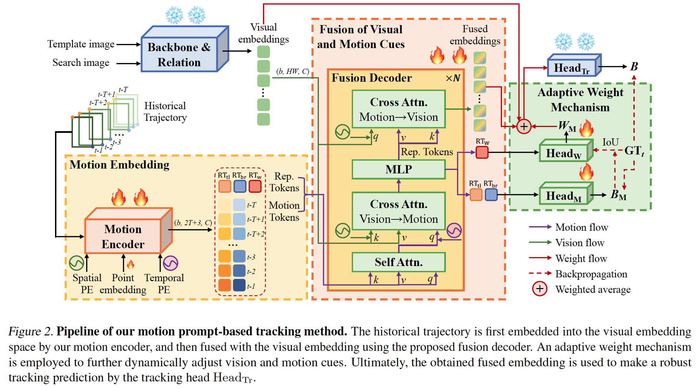
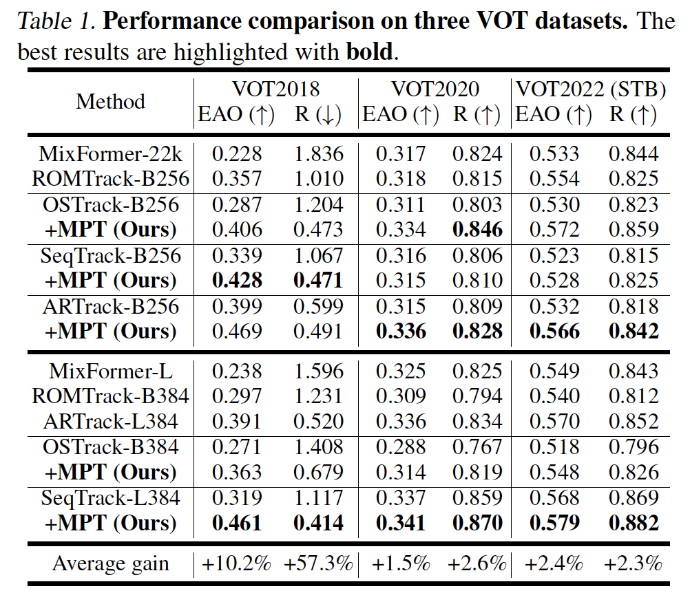
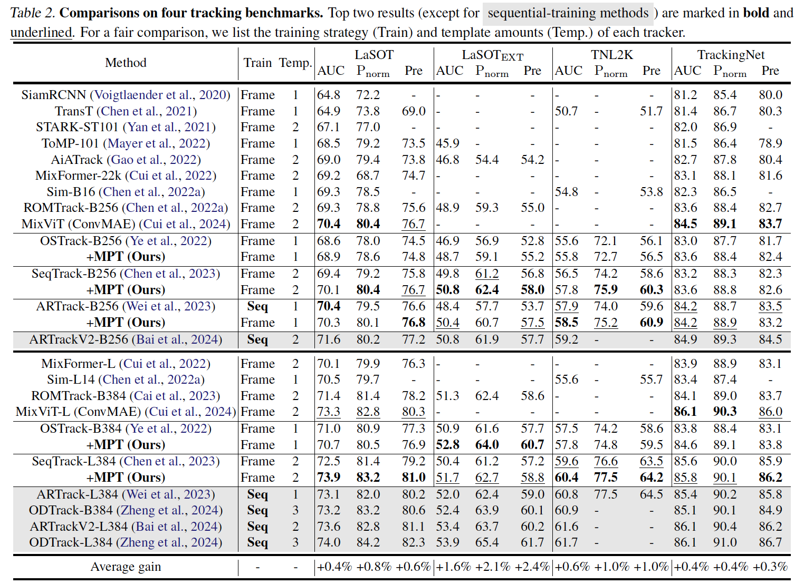

# Motion-Prompt-Tracking
PyTorch implementation of "Efficient Motion Prompt Learning for Robust Visual Tracking" (ICML2025)

Paper can be found [here](https://arxiv.org/pdf/2505.16321), and codes will be released soon.

## Introduction
In this paper, we propose a lightweight and plug-and-play motion prompt tracking method (MPT). It can be easily integrated into existing vision-based trackers to build a joint tracking framework leveraging both motion and vision cues, thereby achieving robust tracking through efficient prompt learning. A motion encoder with three different positional encodings is proposed to encode the long-term motion trajectory into the visual embedding space, while a fusion decoder and an adaptive weight mechanism are designed to dynamically fuse visual and motion features.


We integrate our motion module (MPT) into three different trackers with five models in total. Experiments on seven challenging tracking benchmarks demonstrate that the proposed motion module significantly improves the robustness of vision-based trackers, with minimal training costs and negligible speed sacrifice.

<div align="center">
  
</div>



We also make a video to show qualitative comparisons on three challenging sequences, which can be found [here[pwd:wxct]]( https://pan.baidu.com/s/1EcL0wxaMUIwFrbYLiX1Hsw?pwd=wxct).


## Installation the environment and set project paths
The environment installation and training configurations (like project path, pretrained models) are similar to the baseline trackers, e.g., OSTrack, please refer to [OSTrack](https://github.com/botaoye/OSTrack). 

## Data Preparation
Download the trajectory data of the three training datasets (LaSOT, GOT-10K, TrackingNet) [here](todo), and put them in ./traj_data. It should look like this:
  ```
  ${PROJECT_ROOT}
    -- traj_data
      |-- lasot
      |-- got10k
      |-- tn
  ```

Put pretrained baseline models in ./pretrained_models. The baseline model name must match `MODEL.PRETRAIN_FILE` in your configuration file (`./experiments/ostrack/xxx.yaml`), e.g.:
```yaml
MODEL:
  PRETRAIN_FILE: OSTrack_mae256_ep0300.pth.tar
```


## Training and Testing
Please see eval.sh to find the commands for training and testing.

## Models and Results
Models and results can be found [here[pwd:8j2g]](https://pan.baidu.com/s/1WILde5AY7l0cFVm0hdF8hg?pwd=8j2g).

## Acknowledgments
We acknowledge the Segment Anything Model ([SAM](https://github.com/facebookresearch/segment-anything)) for inspiring our prompt tracking methodology. 
In addition, our work is integrated into three visual trackers, i.e., [OSTrack](https://github.com/botaoye/OSTrack), [SeqTrack](https://github.com/microsoft/VideoX/tree/master/SeqTrack), and [ARTrack](https://github.com/MIV-XJTU/ARTrack). Thanks for these concise and effective SOT frameworks. 
